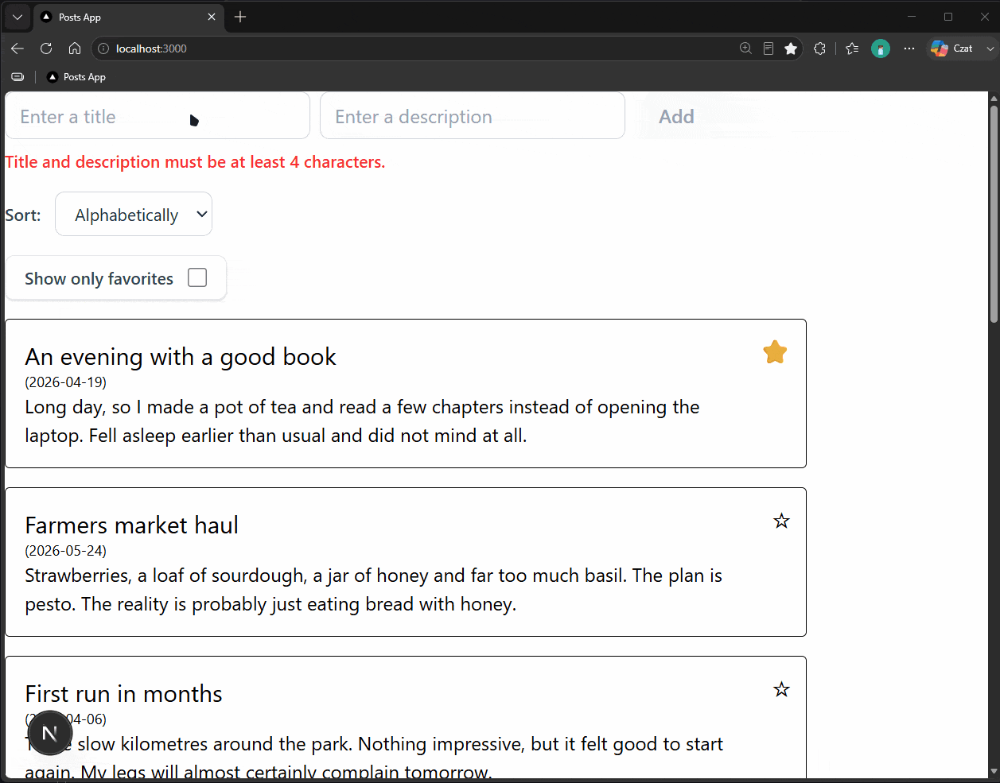
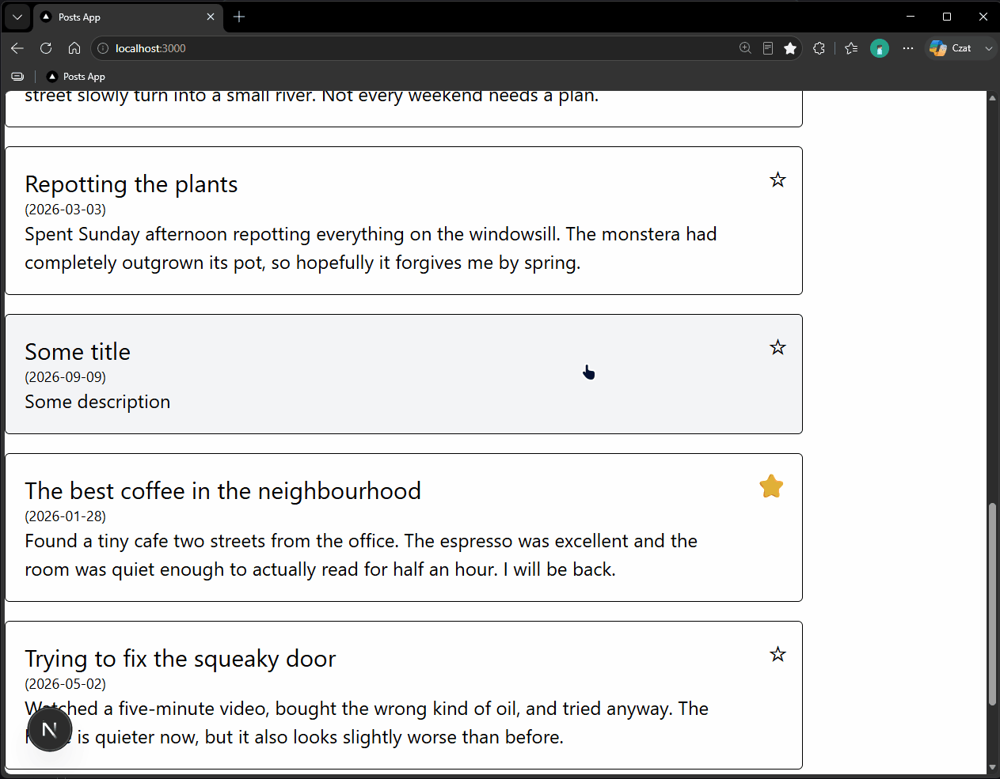
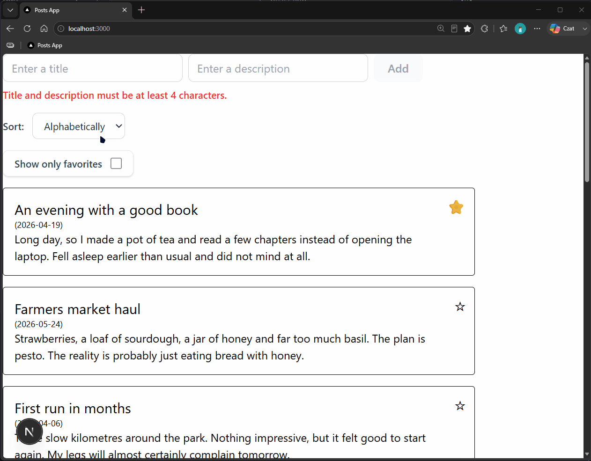
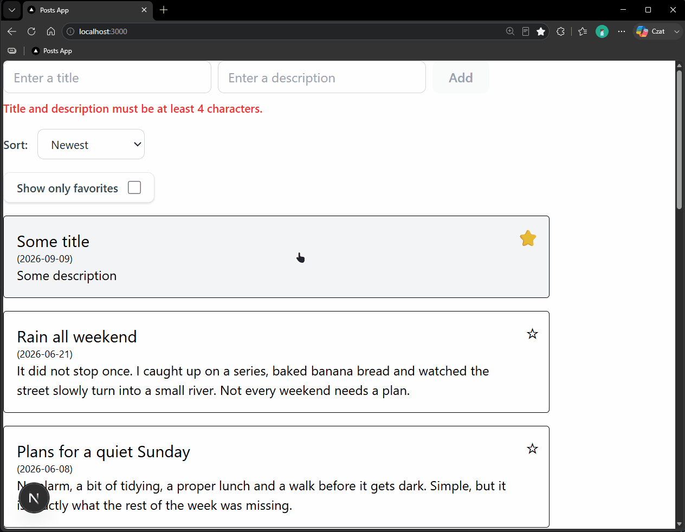
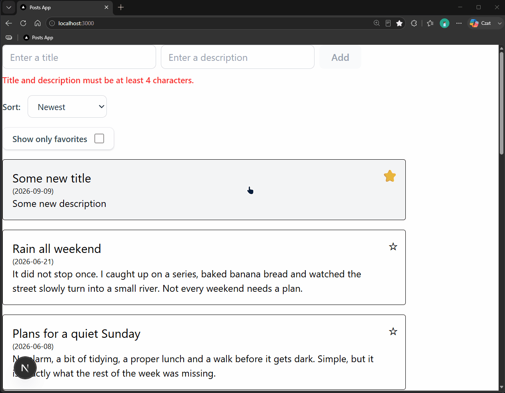
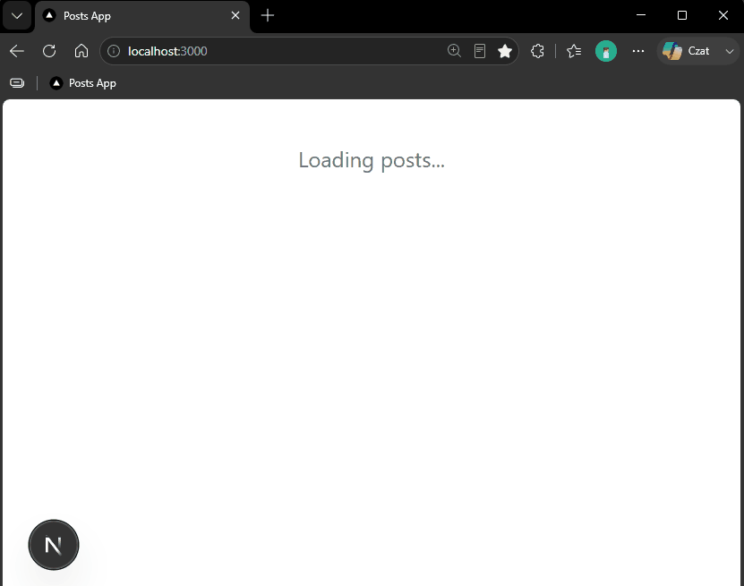

# React Posts App

A small web app for creating, browsing and managing posts. Form-driven UI with
client-side validation and toast feedback, backed by a REST API (a `json-server`
mock for local development).

## Demo

### Adding a post

The form validates as you type and only enables **Add** once the title and body
are long enough. A toast confirms the result.



### Favorites

Star any post and filter the list down to favorites only.



### Sorting

Sort the list alphabetically, or by date (newest / oldest).



### Editing

Open a post and edit it inline in the side panel.



### Deleting

Deleting asks for confirmation first.



### Loading and error states

A status message is shown while posts load; if the API is unreachable the app
says so and recovers on the next refresh.



## Features

- Create, edit and delete posts
- Mark posts as favorites and filter to favorites only
- Sort alphabetically, or by date (newest / oldest)
- Client-side form validation with Zod
- Incoming API data is validated too — malformed records are dropped from the
  list and logged to the console instead of breaking the UI
- Toast notifications for every action and for API errors
- Dedicated loading and error screens
- Fully typed with TypeScript

## Tech stack

- **Next.js 16** (App Router) + **React 19**
- **TypeScript** – static typing across the codebase
- **Tailwind CSS 4** – utility-first styling
- **Zod** – form and API-response validation
- **Sonner** – toast notifications
- **json-server** – mock REST API for local development
- **ESLint** – linting and consistency

## Running locally

**Prerequisites:** Node.js 20+ and npm. Nothing else to install globally — and
there is no separate backend to set up, the mock API and its data both live in
this repo.

The app talks to a REST API at `http://localhost:5000/posts/` (set in
[`app/constants/constants.ts`](app/constants/constants.ts)). The bundled
[`db.json`](db.json) is a small seed dataset served by
[`json-server`](https://github.com/typicode/json-server).

```bash
# 1. install dependencies
npm install

# 2. start the mock API — separate terminal, run from the repo root.
#    npx downloads json-server automatically the first time.
npx json-server@1 db.json -p 5000

# 3. start the app
npm run dev
```

Open <http://localhost:3000>. That's it — the list should load with 11 posts.

`json-server` writes changes back to `db.json` as you use the app — run
`git checkout db.json` to restore the seed data. It also contains two
deliberately invalid records to show the API-response validation in action;
they never appear in the list.

**Using your own API instead:** point `API_URL` in
[`app/constants/constants.ts`](app/constants/constants.ts) at any endpoint that
supports `GET /posts`, `POST /posts`, `PATCH /posts/:id` and
`DELETE /posts/:id`.

### Production build

```bash
npm run build
npm run start
```

## Gained skills

- Structuring a React app by feature, keeping view components separate from data
  and state logic
- Managing shared state with `useReducer` + Context instead of prop drilling
- Writing custom hooks to isolate concerns — initial fetch (`useFetchPosts`),
  mutations (`usePosts`), list and UI state (`useListPosts`)
- Handling the full async lifecycle: loading, success and error states, plus a
  cleanup guard against out-of-order responses
- Runtime validation with Zod on both form input and untrusted API responses
- Integrating a REST API (GET / POST / PATCH / DELETE) against a `json-server` mock
- Styling with Tailwind CSS and giving feedback through toast notifications
- Using TypeScript throughout — shared interfaces and typed reducer actions

## Project structure

```
app/
  ProjectApp.tsx          top-level component, wires everything together
  page.tsx / layout.tsx   Next.js entry points
  constants/              API base URL
  types/                  shared types (IPost, SortOption)
  services/postsApi.ts    fetch calls to the API
  hooks/                  useFetchPosts (initial load), usePosts (mutations)
  store/                  React context + reducer for the posts list
  validation/             Zod schemas and validators
  features/
    posts/                AddPost, EditPost
    list/                 ListPosts, PostElement, ListSorter, favorites filter
    modal/                side panel: details, edit, delete confirm
    toast/                API error toast
db.json                   json-server seed data
```
